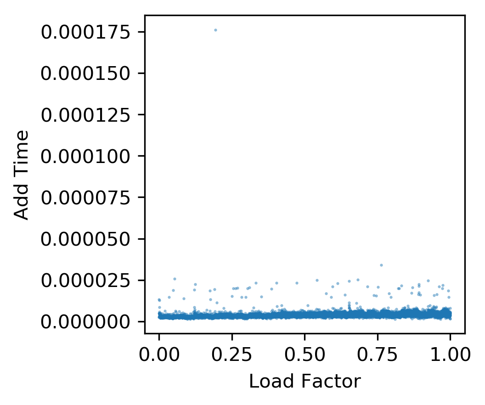
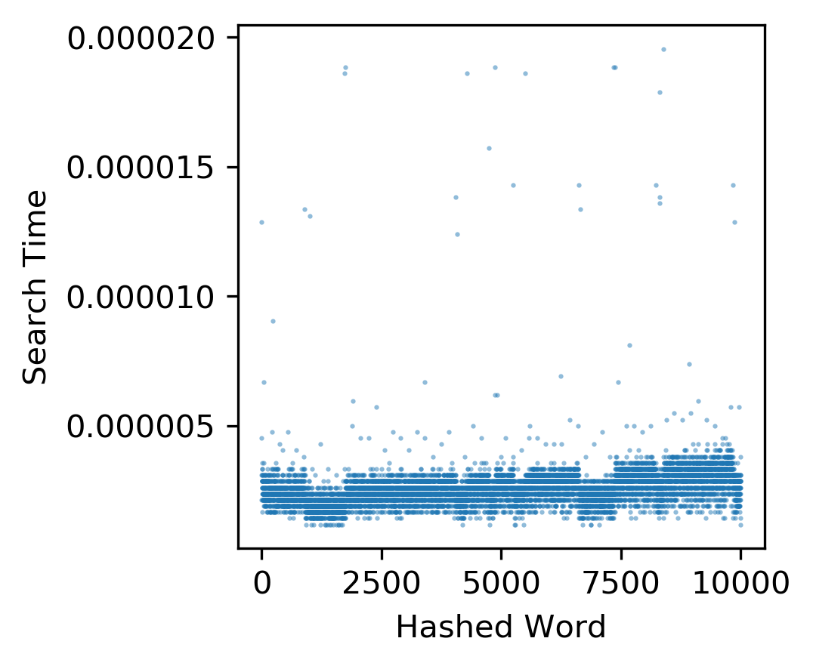

# Hash tables

[](https://travis-ci.com/cu-swe4s-fall-2019/hash-tables-tlfobe)


## About

This repository is an implementation and benchmarking of various hash functions and collision resolution strategies. Follow the instalation instructions below to get started!

## Installation

This repository depends on `matplotlib` for generating scatter plots of the various collision resolution benchmarks. To install `maplotlib` use the following code:
```
conda install matplotlib --yes
```

Otherwise if you're running Python3.6, you should be able to run this program.

## Usage

This program entirely operates out of the `collsion_resolution.py`. Basic usage looks something like this:

```
python collision_resolution.py --hash_fxn [hash-function] --col_res [collision-resolution] --filename [path-to-data] --out_id [whete-to-output]
```
This call will generate 3 plots:
1. Hash Value Scatter
2. Time to Add to Hash Table Scatter
3. Time to Search Hash Table Scatter

In this package we have ascii, polynomial rolling and FNV hashing functions implemented. These can be accessed using the `hash_fxn` input of `ascii`, `rolling` or `FNV`.

We have also implemented 3 types of collision resolution strategies as well. `col_res` options are `LinearProbe`, `ChainedHash` and `QuadraticHash`.

We have examples of random hashing keys in `data/rand_words.txt` and examples of non random hasing keys in `data/non_rand_words.txt`.


## Benchmarking

Here we will go through some of the benchmarking results between each of the hash_fxn methods and conflict resolution strategies.

We'll begin this example with a simple case. Using `data/random_words.txt`, `ascii` hashing and the `LinearProbe` collision resolution stategy.

```
python collision_resolution.py --hash_fxn ascii --col_res LinearProbe --filename data/rand_words.txt --out_id figures/example
```


For the `ascii` hash function, we see that there is some clear stratification. This is likely due to similar words being hashed to similar locations in this function,


For the add and search benchmarking, we see there is a clear linear relationship between add time and load factor. As load factor increases it becomes increasingly hard to find a free spot in the hash table. As the search benchmark also followed the same order as the add benchmark, they share the same linear trend. That being, we see a linear relationship with the search time and the load factor of the time a value was added to the table.

We'll now compare these simple methods on non-random values. These are meant to represent samples from scientific studies that often share similar naming convetions.

```
python collision_resolution.py --hash_fxn ascii --col_res LinearProbe --filename data/random_words.txt --out_id figures/example_nonrand_
```


The `ascii` hash function, when paired with highly similar ordered words, we see that the hash function does not do a great job of separating individual keys. In fact we see an ordered distribution for different groupings of words, which is undesireable.


We see a similar linear trend in the search and add benchmarks as the random word keys, however, now there are no floor values that are found instantly. Since all values are closely hashed together when probing for new values, `LinearProbe` spends a long time linearly searching through already populated table values. The same trend is seen with the search protocol.


Now we'll try a more dispersive hash function, the polynomial `rolling` hash function.
```
python collision_resolution.py --hash_fxn rolling --col_res LinearProbe --filename data/rand_words.txt --out_id figures/example_rand_
```


When using a polynomial `rolling` hash function on random words we get a much more random distribution of hash values.


We see much better performance as a function of load factor for the add and search benchmarks. We only see computational spikes when the hashtable begins reachin maximum capacity.

We'll now take a look at a polynomial `rolling` hash's efficiency at hashing non-random words.

```
python collision_resolution.py --hash_fxn rolling --col_res LinearProbe --filename data/non_rand_words.txt --out_id figures/example_nonrand_
```


For the non-random words, we do see patterns in the hasing values, as many of the hashes share several characters, however these hash values are much more evenly distributed compared to the `ascii` hash distribution.


We see similar improvements as the random word case. However, we see a much more effective performance at higher load factors, possibly due to how similar words are more likely to be placed far from each other.

We'll also cover the `FNV` hasing function was designed as a fast hash. It takes use of binary operations, which are supposed to be especially quick.

```
python collision_resolution.py --hash_fxn FNV --col_res LinearProbe --filename data/rand_words.txt --out_id figures/example_rand_
```


We see the `FNV` hash gives a similarly scrambled hash distribution as the `rolling` hash function.


Similarly to the `rolling` hash function we see a great improvement over the `ascii` hashfunction. Speedwise this implementation is similar to the `rolling` hash function.

We'll now investigate `ChainedHash` collision stratgy. This hashtable has no limit to the number of values that can be stored in it. We'll start our investigation off with `ascii` hash function again on random words.


```
python collision_resolution.py --hash_fxn ascii --col_res ChainedHash --filename data/rand_words.txt --out_id figures/example_rand_
```

As we are using the same `ascii` hash function as shown above, We'll only discuss the add and search benchmarks.




In chained hash tables, since arrays are at each index, we don't see much extra time spent adding values at similar hash values. The search table does not share the same distribution, but is still quite fast. These striations likely reflect the average size of the array a hash index has.

We next explore `ChainedHash` and the `ascii` hash function using non-random words!


```
python collision_resolution.py --hash_fxn ascii --col_res ChainedHash --filename data/non_rand_words.txt --out_id figures/example_nonrand_
```


When using `ascii` hashing with `ChainedHash` collision strategy, we see a similar linear as with `LinearProbe`, however we see many more values between quickly hashed values and those following the linear relationship. Rather than having to iterate over the entire hashtable as is the case in the `LinearProbe` algortihm, here we only iterate over the lists at each hash index, however as we appreach our load factor, these become highly populated due to the closeness of mapping from `ascii` hasing on non-random words.

Now we'll look into how `QuadraticProbe` performs compared to the other two hashing methods.

```
python collision_resolution.py --hash_fxn ascii --col_res QuadraticProbe --filename data/rand_words.txt --out_id figures/example_rand_
```

Here are the random distributions:


```
python collision_resolution.py --hash_fxn ascii --col_res QuadraticProbe --filename data/non_rand_words.txt --out_id figures/example_nonrand_
```

Here are the non-random distributions:


We see the `QuadraticProbe`random word hash distribution adopts a $f(x) = \sqrt{x}$ like curve. This resolves the issue with `LinearProbe` where similar words hash to the same place. Now similar words hash to the same place, however the quadratic term brings them far from each other.

We see a similar paterning as the `ChainedHashing` and `ascii` hash function. This occurs because similar keys are still hashed to the same place, and while conflicts aren't resolved to the next open index, they are pushed down the same $i^{2}$ series. This results in consistent series of indexes that are used to hash similar values, acting very similarly to an array.

Now let's explore how `rolling` hash function interacts with the other two collision resolution methods.
